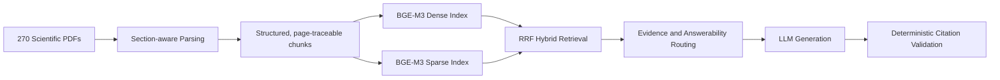

# Literature RAG for Water Treatment

An evidence-grounded RAG system for scientific water-treatment literature. This
is not a generic “chat with PDF” demo: it is a frozen, evaluated pipeline built
around retrieval quality, answerability boundaries, traceable provenance, and
failure analysis.

The release corpus contains **270 real scientific PDFs**. The production demo
uses the frozen `section_hybrid` pipeline: section-aware chunks, BGE-M3 dense
and sparse retrieval, and RRF fusion.

## Architecture



## Key Features

- Section-aware scientific-PDF ingestion with paper, page, section, and chunk provenance.
- BGE-M3 Dense + Sparse hybrid retrieval with RRF (`section_hybrid`).
- Evidence-aware actions: answer, clarify, refuse, partial answer, and premise correction.
- Deterministic citation validation after generation; citations only map to retrieved sources.
- Leakage-aware evaluation, paper-disjoint final acceptance, and documented failure analysis.
- A local FastAPI + Streamlit demo with live runtime status; the UI does not load an index itself.

## Final Acceptance

The final release uses a fresh 32-case acceptance set with **zero Eval V2 gold-paper overlap** and PDF evidence relocation validation with **0 errors**.

| Metric | Result |
| --- | ---: |
| Recall@10 | 91.3% |
| PageHit@10 | 91.3% |
| EvidenceSpanHit@10 | 87.0% |
| Action Accuracy | 75.0% |
| ANSWERABLE Accuracy | 71.4% |
| NO_EVIDENCE Recall | 100% |

**Verdict: `FINAL_ACCEPT_WITH_LIMITATIONS`.** The release gates for retrieval
and deterministic answerability pass. Read the methodology, frozen-input hash,
and limitations in [docs/evaluation.md](docs/evaluation.md).

## Evaluation Notes

Automatic Citation Support is **61.9%** and the automatic Unsupported Claim
metric is **42.86%**. The latter is **not a hallucination rate**. The validator
is intentionally conservative and is affected by quick-mode 1,200-token
truncation, bibliographic-claim detection, and normalization. The evidence-level
audit found **10 SUPPORTED / 1 flagged UNSUPPORTED**; the lone flag was the
normalization artifact `34.64 mg/g` versus `34.64mg/g`.

The system does not claim “zero hallucination.” It reports what the retrieved
evidence and deterministic validator can support.

## Failure Analysis

Held-out Eval V2 exposed that keyword-only conflict routing generalized poorly:
ordinary answerable evidence containing words such as “increase” and “decrease”
was routed as a conflict. A postmortem ablation found **CONFLICT_OFF: 6 wins / 1
loss**. The unreliable automatic conflict heuristic was removed rather than
tuned to the benchmark. Condition-dependent evidence and genuine source
disagreement are handled in the answer layer with source-specific citations.

## Limitations

- The frozen corpus is 270 primary PDFs; standalone supplementary files and XLSX/CSV supplements are out of scope.
- Text extraction can lose PDF table structure; figure-only evidence is unsupported.
- References are excluded from retrieval to prevent citation leakage.
- There is no automatic conflict classifier; condition-dependent evidence is handled in the answer layer.

The full scope statement is in [LIMITATIONS.md](LIMITATIONS.md).

## Demo

The production UI exposes the live corpus count, dense/sparse index state,
retrieval mode, active LLM configuration, answer citations, and expandable
paper/page/section provenance. No mock or generated UI screenshots are used in
this repository. Screenshots are intentionally not committed until manually
captured from a running release build; follow
[docs/release_smoke_test.md](docs/release_smoke_test.md) to save genuine UI
captures as `docs/assets/demo-answer.png` and `docs/assets/demo-evidence.png`.

## Quick Start

Use the project virtual environment and a local `.env` file. Never commit API
credentials.

```powershell
cd C:\Users\10475\AI_PROJECT\literature_rag_eval_code
Copy-Item .env.example .env
```

Set `OPENAI_API_KEY` and `OPENAI_BASE_URL` in `.env`. The checked-in example
already points the demo at the frozen production artifacts:

```env
PDF_DIR=./data/papers/final_corpus
CHROMA_DIR=./chroma_db_section_aware_270_gpu
COLLECTION_NAME=section_aware_270_gpu
CHUNKING_MODE=section_aware
RETRIEVAL_MODE=hybrid_dense_sparse
SPARSE_INDEX_DIR=./sparse_index_section_aware_270_gpu
```

Start the API and UI in separate terminals:

```powershell
.\.venv\Scripts\python.exe -m uvicorn api_server:app --host 127.0.0.1 --port 8010
.\.venv\Scripts\python.exe -m streamlit run app.py --server.address 127.0.0.1 --server.port 8501
```

Verify the active runtime before a demo:

```powershell
Invoke-RestMethod http://127.0.0.1:8010/health
```

Expected release identity: `v1.0.0-final`, `section_hybrid`, 270 PDFs, 17,028
dense chunks, and a ready sparse index. The Streamlit UI is at
`http://127.0.0.1:8501`; FastAPI documentation is at
`http://127.0.0.1:8010/docs`.

For Windows, `launcher.pyw` starts the same API/UI configuration and waits for
runtime warmup before opening the browser. It never rebuilds or replaces an
index.

## Tests

Run the repository test suite:

```powershell
.\.venv\Scripts\python.exe -m pytest
```

The final release target is **189 passed**. Acceptance data and corpus artifacts
are intentionally ignored by Git; public methodology and final metrics live in
[docs/evaluation.md](docs/evaluation.md).

## License and Data

This repository does not publish the local corpus, vector indexes, evaluation
gold evidence, or API credentials. Check source-paper licensing before using
the corpus outside this project.
