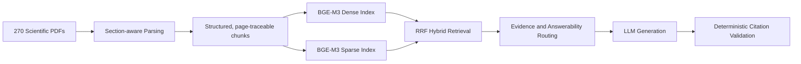
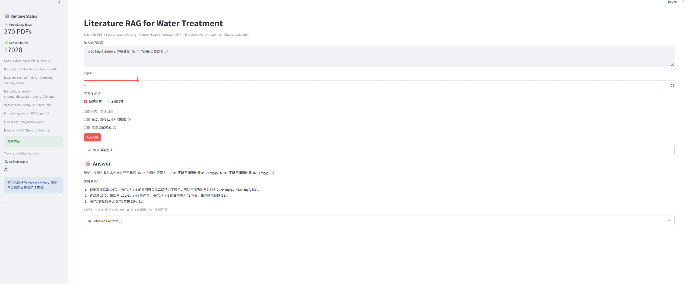
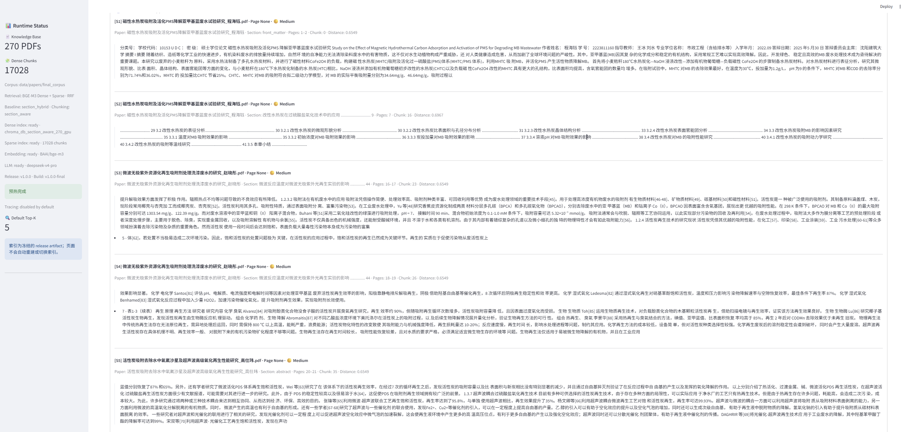
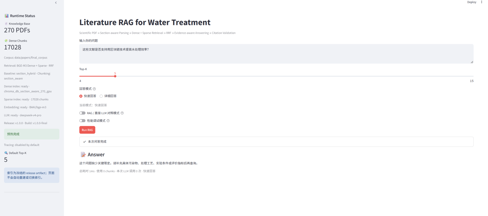

# 水处理科研文献 RAG 系统

[English Version](README_EN.md)

这是一个面向水处理科研文献的 evidence-grounded RAG 系统。它不是普通的
“Chat with PDF” 演示，而是一条已冻结、已评测的端到端链路，重点关注检索质量、
Answerability 边界、证据可追溯性与 Failure Analysis。

发布版本包含 **270 篇真实科研 PDF**，使用冻结的 `section_hybrid` 基线：
Section-aware chunks、BGE-M3 Dense Retrieval + Sparse Retrieval，以及 RRF 融合。

## 项目简介

系统围绕科研文献问答中真正影响可信度的问题设计：

- Section-aware scientific PDF ingestion，保留 paper / page / section / chunk provenance；
- BGE-M3 Dense + Sparse Hybrid Retrieval，并使用 RRF 融合；
- 基于证据的 Answerability：answer、clarify、refuse、partial answer、premise correction；
- 生成后的 deterministic Citation Validation，引用只映射到本次检索来源；
- leakage-aware evaluation、paper-disjoint final acceptance 与 Failure Analysis；
- 本地 FastAPI + Streamlit 演示，页面显示真实运行状态，不在 UI 内重建索引。

## 系统架构



## 最终评测

v1.0.0 使用一套冻结、fresh 的 **32-case** Final Acceptance；其 gold-paper IDs 与
Eval V2 **零重叠**，所有有证据的 case 均重新定位到冻结本地 PDF，验证结果为 **0 errors**。

| 指标 | 结果 |
| --- | ---: |
| Recall@10 | 91.3% |
| PageHit@10 | 91.3% |
| EvidenceSpanHit@10 | 87.0% |
| Action Accuracy | 75.0% |
| ANSWERABLE Accuracy | 71.4% |
| NO_EVIDENCE Recall | 100% |

**Verdict：`FINAL_ACCEPT_WITH_LIMITATIONS`。** 检索与 deterministic
Answerability 的发布门槛均通过。方法、冻结输入哈希与适用边界见
[docs/evaluation.md](docs/evaluation.md) 和 [LIMITATIONS.md](LIMITATIONS.md)。

### Citation 与 Unsupported Claim 指标说明

Automatic Citation Support 为 **61.9%**，automatic Unsupported Claim metric 为
**42.86%**。后者**不是 hallucination rate**。该自动 validator 有意保守，结果会受到
quick-mode 1,200-token truncation、bibliographic claim detection 与 normalization 的影响。

evidence-level audit 为 **10 SUPPORTED / 1 flagged UNSUPPORTED**；唯一 flag 是
`34.64 mg/g` 与 `34.64mg/g` 的空白 normalization artifact。项目不宣称“零幻觉”或
“完全可信”，而是如实报告检索证据与 deterministic validator 能支持的范围。

## Demo

以下图片均直接来自最终 Streamlit v1.0.0 runtime，不使用 mock 或生成式截图。

### 证据驱动回答



示例展示最终 270-paper runtime 对 MB 吸附容量的证据支持回答与 source citation。

### Evidence 溯源



Retrieved Contexts 展示支持回答的 source paper、page range、section、chunk 与 distance
metadata，便于回溯证据来源。

### 保守 Answerability / 无证据拒答



当问题缺少必要条件或证据不足时，系统会澄清或拒答，而不是生成无依据结论。

## Failure Analysis

已消费的 held-out Eval V2 曾暴露 keyword-based auto-conflict routing 的泛化问题：
普通可回答证据中出现 “increase” 与 “decrease” 等词，就可能被错误路由为 conflict。
后续 ablation 得到 **CONFLICT_OFF：6 wins / 1 loss**，因此项目删除了不可靠 heuristic，
而不是为了 benchmark 继续堆叠规则。

Eval V2 之后仅作为 regression/postmortem 材料，不再作为新的 held-out 泛化结论。
最终发布证据来自 fresh、paper-disjoint 的 Final Acceptance。条件差异与真实来源分歧由
回答层按来源、指标和实验条件呈现，并附带 citation provenance。

## 局限性

- 冻结语料为 270 篇主 PDF，不包含独立 Supplementary files；
- 不解析 XLSX/CSV supplementary datasets；
- PDF table 在文本提取时可能丢失行列结构，Figure-only evidence 不在当前覆盖范围；
- References 被主动排除出检索索引，以避免 citation leakage；
- 不做 automatic conflict classification；条件差异由回答层结合来源与实验条件呈现。

完整边界说明见 [LIMITATIONS.md](LIMITATIONS.md)。

## 快速开始

使用项目虚拟环境和本地 `.env`；不要提交 API 凭据。

```powershell
cd C:\Users\10475\AI_PROJECT\literature_rag_eval_code
Copy-Item .env.example .env
```

在 `.env` 中设置 `OPENAI_API_KEY` 与 `OPENAI_BASE_URL`。已提交的示例配置指向冻结发布产物：

```env
PDF_DIR=./data/papers/final_corpus
CHROMA_DIR=./chroma_db_section_aware_270_gpu
COLLECTION_NAME=section_aware_270_gpu
CHUNKING_MODE=section_aware
RETRIEVAL_MODE=hybrid_dense_sparse
SPARSE_INDEX_DIR=./sparse_index_section_aware_270_gpu
```

分别启动 API 与 UI：

```powershell
.\.venv\Scripts\python.exe -m uvicorn api_server:app --host 127.0.0.1 --port 8010
.\.venv\Scripts\python.exe -m streamlit run app.py --server.address 127.0.0.1 --server.port 8501
```

演示前可核对运行时身份：

```powershell
Invoke-RestMethod http://127.0.0.1:8010/health
```

预期为：`v1.0.0-final`、`section_hybrid`、270 PDFs、17,028 indexable Dense chunks
与 ready sparse index。Streamlit 位于 `http://127.0.0.1:8501`，FastAPI docs 位于
`http://127.0.0.1:8010/docs`。Windows 下 `launcher.pyw` 会启动同一 API/UI 配置，
等待 runtime warmup 后打开浏览器，不会重建或替换索引。

## 测试

```powershell
.\.venv\Scripts\python.exe -m pytest
```

v1.0.0 最终验证结果为 **189 passed**。Acceptance 数据与 corpus artifacts 有意不纳入 Git；
公开方法与最终指标见 [docs/evaluation.md](docs/evaluation.md)。

## 数据与许可

本仓库不发布本地 corpus、vector indexes、evaluation gold evidence 或 API credentials。
在项目范围外使用源论文前，请自行核对其许可条件。
